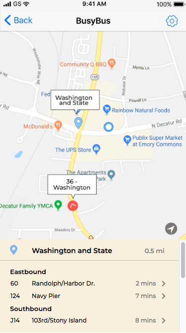

# BusyBus Front End Challenge

Here is the link to the screen: [https://hd21.github.io/frontend-challenge/]

This is the final challenge under the Fundamdentals module of Bloc's UX Design Track. Featured in this project is the bus information and tracking screen for the BusyBus mobile application. Modern HTML and CSS were used to display images, icons and information.
